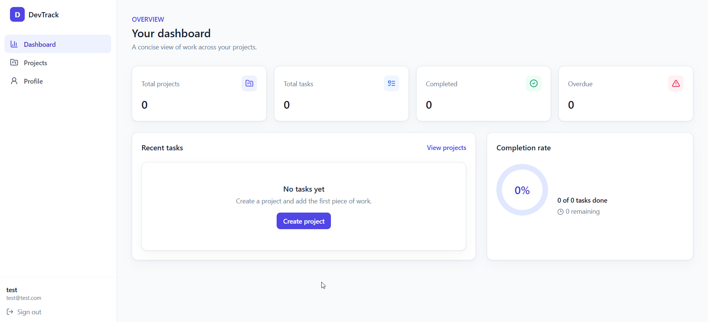
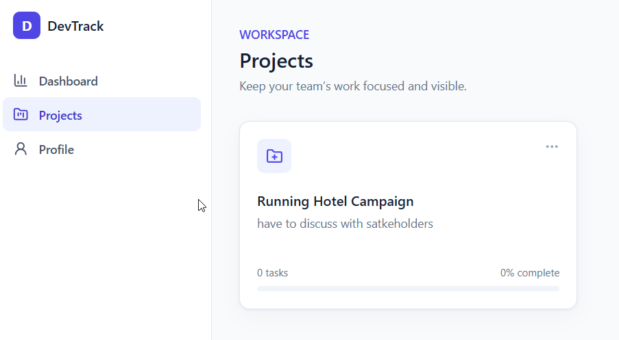
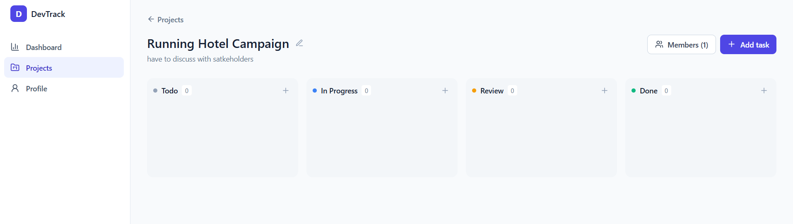
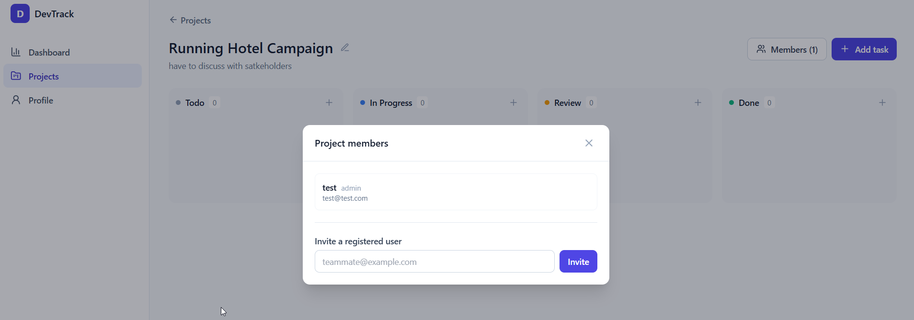
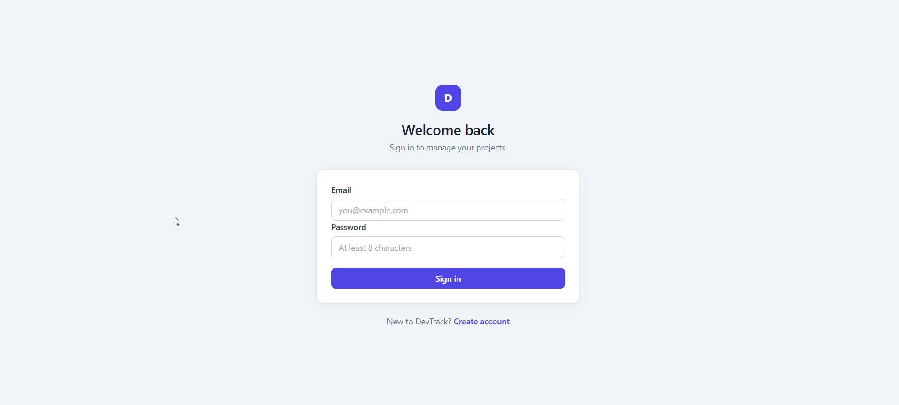

# 🚀 DevTrack

A modern full-stack project management platform inspired by tools like Trello and Jira.

DevTrack enables teams to manage projects, organize tasks, collaborate through comments, and monitor progress from an intuitive dashboard.

> Built using React, TypeScript, Express, Prisma and PostgreSQL.

---


## ✨ Features

-  JWT Authentication
-  User Registration & Login
-  Create and Manage Projects
-  Task Management
-  Task Comments
-  Project Collaboration
-  Dashboard Analytics
-  Protected Routes
-  RESTful API
-  Prisma ORM
-  PostgreSQL Database
-  Responsive UI with Tailwind CSS


---


## 🎥 Video Walkthrough


https://www.loom.com/share/40d07786778c4ca6bf14861808c625f2


---


# 🛠 Tech Stack


## Frontend

- React
- TypeScript
- Vite
- Tailwind CSS
- React Router
- Axios


## Backend

- Node.js
- Express
- TypeScript
- Prisma ORM
- JWT Authentication
- bcrypt


## Database

- PostgreSQL


## Development

- pnpm Workspace
- Git
- GitHub


---


# 🏗 Architecture

```
React (Frontend)
        │
 REST API (Express)
        │
 Prisma ORM
        │
 PostgreSQL
```


---


# 📸 Screenshots

## Dashboard



---

## Creating a Project



---

## Project Details



---

## Team Collaboration



---

## Login Page



---


# 📁 Folder Structure

```
devtrack
│
├── backend
│   ├── prisma
│   ├── src
│   │   ├── controllers
│   │   ├── routes
│   │   ├── middleware
│   │   ├── services
│   │   ├── config
│   │   └── utils
│
├── frontend
│   ├── src
│   │   ├── components
│   │   ├── contexts
│   │   ├── layouts
│   │   ├── pages
│   │   ├── services
│   │   └── types
│
├── package.json
└── pnpm-workspace.yaml
```


---


# 🚀 Getting Started

## Clone Repository

```bash
git clone https://github.com/sarbeshmallick/devtrack.git

cd devtrack
```

---

## Install Dependencies

```bash
pnpm install
```

---

## Generate Prisma Client

```bash
pnpm --filter backend prisma generate
```

---

## Run Database Migrations

```bash
pnpm --filter backend prisma migrate dev
```

---

## Start Development Server

```bash
npm run dev
```

---

## Environment Variables

Backend `.env`

```env
DATABASE_URL=

JWT_SECRET=

PORT=5000
```

Frontend `.env`

```env
VITE_API_URL=http://localhost:5000
```


---


# 📡 API Overview

All routes except registration and login require

```
Authorization: Bearer <token>
```

| Method | Endpoint | Description |
|---------|----------|-------------|
| POST | /auth/register | Register User |
| POST | /auth/login | Login |
| GET | /dashboard | Dashboard Summary |
| GET | /projects | Get Projects |
| POST | /projects | Create Project |
| GET | /tasks | Get Tasks |
| POST | /tasks | Create Task |
| GET | /profile | User Profile |


---


# 🔐 Authentication

Authentication is implemented using JWT.

After login, the backend returns a signed token.

Every protected request requires:

```
Authorization: Bearer <JWT Token>
```


---


# 🎯 Future Improvements

- Drag & Drop Kanban Board
- Real-time Collaboration
- Notifications
- File Attachments
- Task Labels
- Activity Timeline
- Search & Filtering
- Docker Support
- GitHub Actions CI/CD
- Email Notifications


---


# 📚 What I Learned

This project helped me gain hands-on experience with:

- Building REST APIs
- JWT Authentication
- Express Middleware
- Prisma ORM
- PostgreSQL
- React Context API
- Protected Routes
- Full-stack application architecture
- Git Workflows
- Monorepo development


---


# 👨‍💻 Author

**Sarbesh Mallick**

GitHub

https://github.com/sarbeshmallick

LinkedIn

(https://www.linkedin.com/in/sarbesh/)

---


